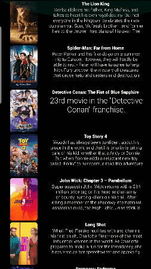

## Flix Part 2

### User Stories
1) adding full black UI
2) an icon on a toolbar to return previously activity
3) new logo
4) new splash screen

#### REQUIRED (10pts)

- [x] (8pts) Expose details of movie (ratings using RatingBar, popularity, and synopsis) in a separate activity.
- [x] (2pts) Allow video posts to be played in full-screen using the YouTubePlayerView.

#### BONUS

- [ ] Trailers for popular movies are played automatically when the movie is selected (1 point).
  - [x] When clicking on a popular movie (i.e. a movie voted for more than 5 stars) the video should be played immediately.
  - [x] Less popular videos rely on the detailed page should show an image preview that can initiate playing a YouTube video.
- [ ] Add a play icon overlay to popular movies to indicate that the movie can be played (1 point).
- [ ] Apply the popular ButterKnife annotation library to reduce view boilerplate. (1 point)
- [x] Add a rounded corners for the images using the Glide transformations. (1 point)

### App Walkthough GIF

 

### Notes

i have some issues with certain of Bonus
## Open-source libraries used
- [Android Async HTTP](https://github.com/loopj/android-async-http) - Simple asynchronous HTTP requests with JSON parsing
- [Glide](https://github.com/bumptech/glide) - Image loading and caching library for Android
